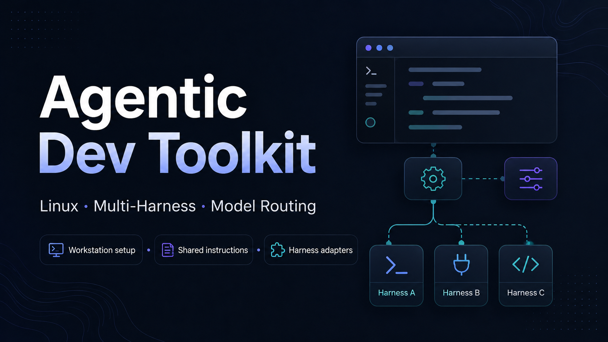

# Agentic Dev Toolkit

<p align="center">
  
</p>

Portable workstation setup, shared agent instructions, harness adapters, and model-routing
configurations for AI-assisted software development.

## What this is

A collection of reusable components for teams using AI coding agents:

- **Linux workstation installer** — a single script that provisions a Debian/Ubuntu machine
  with mise-managed language runtimes, three agent CLIs (OpenCode, Claude Code, Codex), OpenSpec,
  Superpowers, the Karpathy guidelines skill, and the quality tools (shellcheck, gitleaks, PyYAML)
  whose absence otherwise fails silently. Ubuntu under WSL2 is the reference and tested environment.
- **Shared `AGENTS.md` pattern** — a template and adapter set that lets one canonical instructions
  file serve Claude Code, Codex, and OpenCode simultaneously.
- **OpenCode model-routing bundle** — a starter configuration that assigns models to OpenCode's
  built-in agents and adds two custom subagents (`reviewer` and `expert`) for independent review
  and scarce-model escalation.
- **Repository policy** — `.repository-policy.yaml`, a small versioned format letting a repository
  declare its branching model and integration mechanism so agents read the workflow instead of
  guessing it from branch names, with a schema, examples and a validator.
- **WSL toolchain doctor** — a Bash auditor that enforces a Linux-first development boundary
  inside WSL: it checks the `interop` policy, audits PATH hygiene and provenance, verifies that
  `mise`-managed runtimes are not shadowed by Windows executables, and can conservatively
  remediate `wsl.conf` and persistent `PATH=` assignments.

## What this is NOT

- Not a workflow engine or framework — it does not prescribe how you run your development process.
- Not company-specific — there are no proprietary references, org names, or internal tooling.
- Not an OpenSpec or SpecRivet distribution — it can install OpenSpec as a tool, but does not ship
  a workflow schema.

## Supported environments

The Linux installer supports **Debian/Ubuntu family** distributions; **Ubuntu under WSL2** is the
reference and tested environment. It uses `apt` for system packages. The `--skip-platform-check`
flag allows running on non-Debian distributions but these are untested.

WSL is configured from two files with different scopes: `/etc/wsl.conf` is per-distribution and
lives inside it, while `%USERPROFILE%\.wslconfig` configures the WSL2 virtual machine that every
distribution shares. `environments/windows/` holds a reviewed `.wslconfig` template and explains
why the installer does not write it — see
[`environments/windows/README.md`](environments/windows/README.md).

## Repository structure

What a consumer copies from, rather than a full listing. The test suites,
planning documents under `docs/superpowers/`, and the routing bundle's own
evaluation harness are omitted; see `AGENTS.md` for the working layout.

```
agentic-dev-toolkit/
  LICENSE                                          # MIT
  README.md                                        # This file
  environments/
    linux/
      install.sh                                   # Debian/Ubuntu workstation provisioner
    windows/
      .wslconfig                                   # Template: WSL2 VM settings, applied by hand
      README.md                                    # wsl.conf vs .wslconfig, and the restart step
  instructions/
    AGENTS.md                                      # Template: canonical agent instructions
    adapters/
      claude-code/
        CLAUDE.md                                  # Template: one-line @AGENTS.md redirect
        README.md                                  # Claude Code adapter documentation
      codex/
        README.md                                  # Codex adapter documentation
      opencode/
        README.md                                  # OpenCode adapter documentation
  models/
    routing/
      opencode/
        README.md                                  # Model-routing documentation
        opencode.jsonc                             # Config fragment: model/variant map
        .opencode/
          model-routing.md                         # Semantic routing policy
          agents/
            reviewer.md                            # Independent review subagent
            expert.md                              # Escalation-only expert subagent
  repository-policy/
    README.md                                      # Format, usage and agent guidance
    validate.sh                                    # Policy validator
    schema/
      repository-policy.v1.schema.json             # JSON Schema for version 1
    examples/                                      # One file per representative policy
  wsl-toolchain-doctor/
    README.md                                      # Component overview and policy
    wsl-toolchain-doctor.sh                        # Linux-first PATH and toolchain auditor
  docs/
    multi-agent-workspace-guide.md                 # Full guide: AGENTS.md pattern + MCP parity
    wsl-toolchain-doctor.md                        # Toolchain doctor operational documentation
```

## Workstation bootstrap

```bash
# Preview what will be installed
./environments/linux/install.sh --dry-run

# Run the full installation
./environments/linux/install.sh

# Reload shell to pick up PATH changes
exec bash -l
```

Key flags:

| Flag | Purpose |
|---|---|
| `--dry-run` | Print planned actions without changing the system |
| `--upgrade` | Upgrade mutable components and runtime patches |
| `--verify-only` | Verify an existing installation without installing |
| `--project PATH` | Initialize or refresh OpenSpec and create a safe direnv `.envrc` when absent |
| `--skip-runtimes` | Skip mise and language runtime installation |
| `--skip-opencode` | Skip OpenCode installation |
| `--skip-claude` | Skip Claude Code installation |
| `--skip-codex` | Skip Codex CLI installation |
| `--skip-openspec` | Skip OpenSpec installation |
| `--skip-superpowers` | Skip Superpowers configuration |
| `--skip-karpathy` | Skip the Karpathy guidelines skill |
| `--skip-quality-tools` | Skip shellcheck, gitleaks, and PyYAML |
| `--repair-codex` | Remove conflicting Codex installs and reinstall standalone |

Version overrides are available via `--node-version`, `--python-version`, etc., or through
`ADT_NODE_VERSION`, `ADT_PYTHON_VERSION`, and similar environment variables. See
`./environments/linux/install.sh --help` for the full list.

### Project environments

The installer adds direnv's Bash hook and installs its Debian/Ubuntu package. When invoked with
`--project PATH`, it creates this `.envrc` only if the repository has none:

```bash
dotenv_if_exists .env.local
```

Review the generated file and explicitly authorize it with `direnv allow` from the project root.
Place machine-specific variables and secrets in a gitignored `.env.local`; commit `.envrc` only
when its contents are safe for collaborators. direnv loads these values while the shell is in the
project and removes them after leaving it. Existing `.envrc` files are preserved unchanged.

### Quality tools

Three things ship alongside the runtimes because their absence is silent rather
than loud:

| Tool | Installed via | Why it is here |
|---|---|---|
| `shellcheck` | mise | The Debian/Ubuntu package trails upstream by years. A linter that quietly lacks the check you are relying on is worse than no linter |
| `gitleaks` | mise | Same reason, higher stakes: a secret scanner that predates a rule reports clean |
| PyYAML | `pip` into the mise Python | Test suites commonly skip their schema or config checks when `import yaml` fails. The suite then exits 0 with its strongest check never evaluated |

The PyYAML case is the one worth stating plainly: a runner that degrades to a
skip does not report a problem, it reports success. That cannot be fixed from
inside the repository that suffers from it, because the missing piece is on the
workstation.

Both mise tools default to `latest` and are pinnable with `--shellcheck-version`,
`--gitleaks-version`, and `--pyyaml-version` (or `ADT_SHELLCHECK_VERSION`,
`ADT_GITLEAKS_VERSION`, `ADT_PYYAML_VERSION`). `--skip-runtimes` implies
`--skip-quality-tools`, since mise and the managed interpreter are what install
them. A PyYAML failure warns rather than aborting the run.

The two mise tools resolve on `PATH` in an interactive shell, where `.bashrc`
runs `mise activate`. A non-interactive shell — a script, a CI step, an agent
invoking `bash script.sh` — does not source `.bashrc`, so reach them as
`mise exec -- shellcheck …` there. This is how every mise-managed tool behaves
here, not something specific to these two.

### Karpathy guidelines skill

A single Agent Skill carrying [Andrej Karpathy's observations][karpathy] on where
LLM coding goes wrong: state assumptions instead of guessing, prefer the smallest
thing that works, keep edits surgical, and define success criteria you can
actually check. It is installed for all three harnesses by default and skipped
with `--skip-karpathy`.

[karpathy]: https://x.com/karpathy/status/2015883857489522876

Two files cover three harnesses:

| Destination | Read by |
|---|---|
| `~/.claude/skills/karpathy-guidelines/SKILL.md` | Claude Code **and** OpenCode |
| `$CODEX_HOME/skills/karpathy-guidelines/SKILL.md` | Codex |

There is deliberately no third copy under `~/.config/opencode/skills/`. OpenCode
discovers skills in the Claude Code and `.agents` directories as well as its own,
so a dedicated copy would only be another thing to keep in sync.

Only the skill is installed. Upstream also ships `AGENTS.md`, `CLAUDE.md` and
editor rule-file variants of the same text; those would overwrite instruction
files a project already owns, and a skill loads on demand instead of occupying
every prompt.

The source is pinned to a commit of
[`multica-ai/andrej-karpathy-skills`](https://github.com/multica-ai/andrej-karpathy-skills)
and verified against a SHA-256 digest before anything is written. The pin wins:
on the default ref the built-in digest always applies, and a `--karpathy-sha256`
that contradicts it is refused rather than honoured. `--karpathy-ref` selects a
different commit, and because the built-in digest cannot describe that content
you must supply `--karpathy-sha256` with it — an unverifiable ref is refused, not
warned about. The file becomes standing instructions for every agent on the
machine, so there is no path that installs it unverified.

`--verify-only` re-checks the installed files against the same digest, so a skill
that was edited or replaced after installation is reported rather than passing on
the strength of its filename.

### Git credentials on WSL

On WSL the installer generates `~/.local/bin/git-credential-manager-wsl` and, if
nothing else owns the setting, points `credential.helper` at it. Off WSL it does
nothing — there is no Windows credential manager to delegate to. Skip it with
`--skip-git-credential`; point it elsewhere with `--gcm-path`.

The wrapper exists because Git Credential Manager is a Windows program invoked by
Linux git, and that puts two boundaries between them:

- **It cannot read this side's git config.** GCM shells out to *Windows* git,
  whose global config is `C:\Users\<name>\.gitconfig`, not `~/.gitconfig`. A
  `credential.interactive` set on the Linux side is invisible to it, and so is a
  `git -c` override, which travels in `GIT_CONFIG_PARAMETERS`.
- **It cannot read this side's environment.** WSL passes no Linux variable into a
  Windows process unless that variable is named in `WSLENV`.

So the only route that reaches GCM is to export the variable *and* name it in
`WSLENV`. Doing either alone is silently ineffective — which is the trap this
wrapper closes.

What it decides: with no terminal reachable, GCM is told never to prompt.
Otherwise GCM answers an uncached request by opening an embedded web view and
waiting, so an agent harness, cron job or CI run hangs indefinitely instead of
failing. With prompting disabled the same call returns in about a second with
`fatal: Cannot prompt because user interactivity has been disabled.`
Authenticate once from your own terminal and the cached credential serves every
later non-interactive run. `GCM_INTERACTIVE` set explicitly always wins, which is
the escape hatch for authenticating from a non-tty context on purpose.

Two details are load-bearing, and both are covered by tests:

- **The terminal test asks whether `/dev/tty` can be opened**, not whether a file
  descriptor is a tty. Git hands every credential helper pipes on stdin and
  stdout by protocol, so an fd test would misread every interactive run as
  headless; and a human who pipes git's output still has a controlling terminal,
  so this way they keep their prompt.
- **`WSLENV` is appended to, never assigned.** It is shared machine state, and
  overwriting it would silently strip whatever else crosses the boundary.

The wrapper is deliberately harness-agnostic. Configuring this per harness was
rejected: OpenCode's config is generated and would erase the setting on its next
activation, and Claude Code's would only ever cover Claude Code. Git calls the
wrapper whoever the caller is.

None of this depends on the Windows `PATH`, so it is unaffected by setting
`interop.appendWindowsPath=false` — the policy `wsl-toolchain-doctor` audits. The
helper is named by absolute path, and interop, not `PATH`, is what launches a
Windows executable.

For GitHub specifically, routing to the GitHub CLI avoids the Windows round trip
altogether. This installer does not install `gh`, so it does not configure this;
once `gh` is present and authenticated:

```bash
git config --global credential.https://github.com.helper ''
git config --global --add credential.https://github.com.helper '!gh auth git-credential'
```

The empty value first is required, not decoration: `credential.helper` is a
**list**, and a URL-specific section appends to the global helper unless an empty
value resets it. Omit it and GCM stays first in line for GitHub.

## Shared `AGENTS.md` pattern

The core idea: write workspace guidance once in `AGENTS.md`, then give each agent harness access
through its native mechanism.

- **Codex** and **OpenCode** load `AGENTS.md` directly.
- **Claude Code** loads `CLAUDE.md`, which contains a single `@AGENTS.md` import directive.

See [`instructions/AGENTS.md`](instructions/AGENTS.md) for the template and the adapter READMEs
for harness-specific setup:

- [Claude Code adapter](instructions/adapters/claude-code/README.md)
- [Codex adapter](instructions/adapters/codex/README.md)
- [OpenCode adapter](instructions/adapters/opencode/README.md)

The full guide — including MCP server parity across all three harnesses, verification scripts,
and nested-repository patterns — is at
[`docs/multi-agent-workspace-guide.md`](docs/multi-agent-workspace-guide.md).

## OpenCode model-routing

A starter configuration that maps OpenCode's built-in agents to specific models and variants,
adds a read-only `reviewer` on a different model family for adversarial diversity, and gates a
scarce high-end model behind a hidden `expert` agent.

See [`models/routing/opencode/README.md`](models/routing/opencode/README.md) for the model map,
installation instructions, and smoke tests.

## Repository policy

Git has no portable way for a repository to state that it uses GitHub Flow rather than Git Flow,
or that changes arrive by pull request rather than by direct commit. Hosting products enforce
those rules, but that configuration is vendor-specific and an agent working from a clone may not
see it at all.

`.repository-policy.yaml` declares it in the repository:

```yaml
version: 1

branching:
  workflow: github-flow
  stableBranch: main

integration:
  mode: pull-request
```

Branching model and integration mechanism are separate fields on purpose. A branch named `main`
does not imply pull requests, and one named `master` does not imply direct commits — those are
conventions in some environments, not rules of Git, and the format refuses to encode them.

The file declares intent; GitHub rulesets and GitLab protected branches enforce it. Reviewers,
CODEOWNERS, signed commits and required checks stay out by design.

```bash
bash repository-policy/validate.sh
```

See [`repository-policy/README.md`](repository-policy/README.md) for the format, the validator's
exit codes, and how an agent should consume a policy. The reasoning behind it is recorded in
[ADR-0005](https://github.com/Prev-I/agentic-engineering/blob/main/decisions/0005-declare-repository-workflow-as-machine-readable-policy.md)
and the [Repository Workflow Contract](https://github.com/Prev-I/agentic-engineering/blob/main/patterns/repository-workflow-contract.md)
pattern in [agentic-engineering](https://github.com/Prev-I/agentic-engineering).

## Security

- No secrets, tokens, API keys, or connection strings in any committed file.
- MCP server authentication uses ambient credentials (Azure CLI, environment variables, device
  login flows).
- Audit config files before committing — search for `Bearer`, `password`, `connectionString`,
  `-----BEGIN`, `sk-`, `pat:`.

## License

[MIT](LICENSE)
